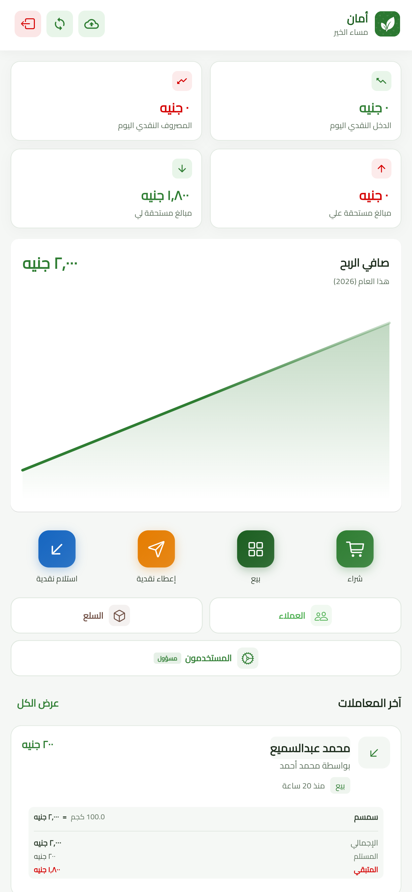
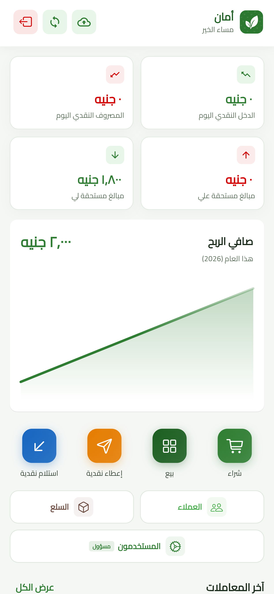
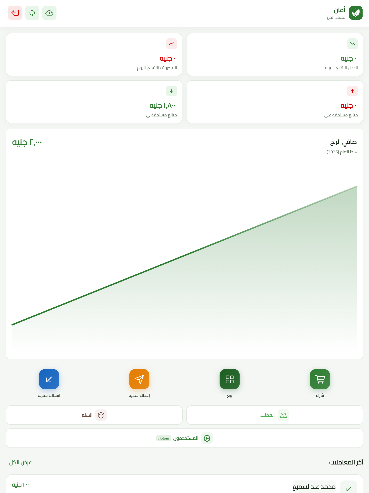
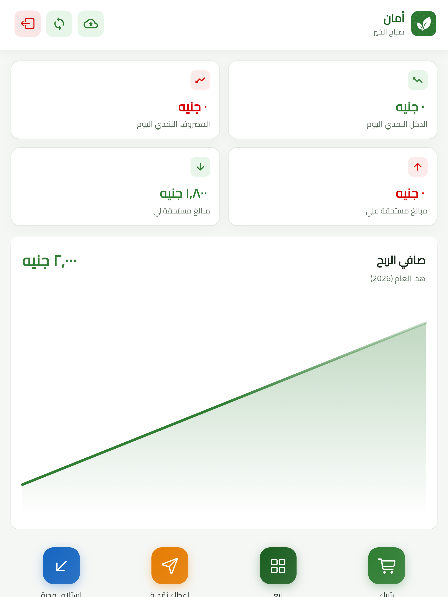

# Responsive Zoom

**Responsive Zoom: Build Once, Scale Everywhere**

A tiny, dependency-free Flutter widget that makes your entire app responsive by **zooming** your UI to fit any screen — instead of forcing you to sprinkle `.w`, `.h`, and `.r` on every single value.

You design for one reference screen size. `ResponsiveZoom` calculates a zoom factor from the real device size (accounting for both scale and aspect ratio) and scales your whole widget tree to match — layout, text, radii, paddings, everything — with zero changes to your widget code.

---

## Why

Most "responsive" packages ask you to rewrite every number in your UI:

```dart
Container(
  width: 80.w,
  height: 30.h,
  decoration: BoxDecoration(
    color: Colors.grey.shade200,
    borderRadius: BorderRadius.circular(6.r),
  ),
  margin: const EdgeInsets.symmetric(horizontal: 12.w),
),
```

That's noisy, easy to forget, and turns every PR into a `.w`/`.h`/`.r` hunt.

With **Responsive Zoom**, you just write normal, plain Flutter numbers:

```dart
Container(
  width: 80,
  height: 30,
  decoration: BoxDecoration(
    color: Colors.grey.shade200,
    borderRadius: BorderRadius.circular(6),
  ),
  margin: const EdgeInsets.symmetric(horizontal: 12),
),
```

No more `.w`. No more `.h`. No more `.r`. **Just write the numbers.**

The scaling happens once, at the root of your app, not on every widget.

---

## Before / After

### Phone screen — `1242x2688`

| Without `ResponsiveZoom` | With `ResponsiveZoom` |
|---|---|
|  |  |

### Large screen — `2064x2752`

| Without `ResponsiveZoom` | With `ResponsiveZoom` |
|---|---|
|  |  |

Without the wrapper, layouts built for one reference size look cramped or oversized on other devices. With `ResponsiveZoom`, the same widget tree scales cleanly to fill and fit every screen, with no per-widget changes.

---

## Responsive Zoom vs. `flutter_screenutil`

| | `flutter_screenutil` | `ResponsiveZoom` |
|---|---|---|
| Setup | Wrap app + call `.init()` | Wrap app only |
| Usage | `.w`, `.h`, `.r`, `.sp` on every value | Plain numbers everywhere |
| Widget code | Coupled to the package | Untouched, portable Flutter |
| Text scaling | Manual (`.sp`) | Scales automatically with the rest of the UI |
| Mental overhead | High — remember the right extension per value | None |
| Aspect-ratio awareness | Width/height scaled independently | Combines size **and** aspect ratio into one zoom factor |

---

## How it works

`ResponsiveZoom` computes a single `zoom` factor by comparing the device's real (logical) screen size to a `referenceSize` you define:

1. It takes the real screen size (physical size ÷ device pixel ratio).
2. It computes a **size scale** from the geometric mean of the short-side and long-side ratios against the reference size.
3. It computes an **aspect-ratio scale** to correct for screens that are relatively wider or narrower than the reference.
4. It combines both into a single `zoom` value.

That `zoom` value is then applied via `FittedBox` + `ConstrainedBox` (to scale the rendered layout) and propagated through an adjusted `MediaQuery` (so `MediaQuery.of(context).size`, padding, and view insets all stay consistent with the zoomed layout).

---

## Installation

```bash
flutter pub add responsive_zoom
```

Then import it wherever you need it:

```dart
import 'package:responsive_zoom/responsive_zoom.dart';
```

That's it — no manual setup, no `.init()` call required.

---

## Usage

### 1. Wrap your app

Just wrap the root of your app with `ResponsiveZoom`:

```dart
ResponsiveZoom(
  child: MaterialApp(
    title: 'Responsive Zoom Example',
    home: const HomePage(),
  ),
)
```

### 2. (Optional) Set a custom reference size

If your designs are based on a different reference screen than the default (`450x960`), set it once — preferably in `main()`, before `runApp`:

```dart
void main() {
  ResponsiveZoom.setReferenceSize(referenceSize: const Size(375, 812));
  runApp(const MyApp());
}
```

You don't need to call this if the default `450x960` reference works for your designs.

### 3. Write plain Flutter — nothing else changes

Every widget underneath `ResponsiveZoom` is written with normal numbers, exactly as you would for a single fixed-size screen:

```dart
Container(
  width: 80,
  height: 30,
  decoration: BoxDecoration(
    color: Colors.grey.shade200,
    borderRadius: BorderRadius.circular(6),
  ),
  margin: const EdgeInsets.symmetric(horizontal: 12),
),
```

That's it — `ResponsiveZoom` handles the scaling for every screen size automatically.

---

## API

| Member | Description |
|---|---|
| `ResponsiveZoom({required Widget child})` | Wraps your app (or any subtree) and applies the computed zoom factor to it. |
| `ResponsiveZoom.setReferenceSize({Size referenceSize})` | Sets the reference design size once, ideally in `main()`. Defaults to `450x960`. |
| `ResponsiveZoom.referenceSize` | The current reference size used for zoom calculations. |
| `ResponsiveZoom.realScreenSize` | The device's real (logical) screen size — physical size ÷ device pixel ratio. |
| `ResponsiveZoom.zoom` | The computed zoom factor for the current device relative to `referenceSize`. |

---

## Notes

- Set the reference size **once**, at startup — changing it at runtime is not the intended use case.
- Because scaling is applied at the root via `FittedBox`/`MediaQuery`, text, icons, paddings, and radii all scale together and stay visually consistent — no separate `.sp` handling needed.